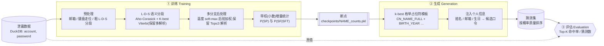

<div align="center">

# 🔐 SE-PCFG

**语义增强 · 个性化口令猜测研究框架**
*A semantically-enhanced, personalized PCFG for password-guessing research*

[](https://www.python.org/)
[](https://duckdb.org/)
[](https://pypi.org/project/pyahocorasick/)
[](#-快速开始--quickstart)
[](#️-使用须知--responsible-use)

</div>

---

## ⚠️ 使用须知 · Responsible use

本项目是**口令安全研究**代码,用于研究人类口令的构造规律、评估口令强度、以及量化在给定个人信息下口令被针对性猜中的风险。

- ✅ 允许:学术研究、口令强度评估、企业自查、面向自有账户/已获授权目标的安全测试。
- 🚫 禁止:未经授权对他人账户进行猜测、撞库或任何形式的攻击。

使用者须对自身行为负全部责任,并遵守所在司法辖区的法律法规。仓库不附带任何泄露数据集或个人信息;所有敏感产物(数据集、断点、生成的明文口令、`teacher.csv`)均已在 [`.gitignore`](.gitignore) 中排除,请勿提交。

---

## 创新点一览 · What makes it unique (at a glance)

传统 PCFG(Weir et al. 2009)只按**字符类别**把口令切成 `L`/`D`/`S`,且对每条口令**只承诺一种切分**、给命中的模板 **+1 整数计数**。语义 PCFG(Veras 2014)、TarGuess/Personal-PCFG、SE#PCFG 等虽引入语义,但同样**只保留一条最可能的解析、每个片段只给一个标签**。SE-PCFG 的核心区别是:**不在训练早期强行消歧**,而是把一条口令的「一份证据」按后验概率**拆分**、以**小数(软)计数**同时喂给多条相互竞争的语义结构。

下表只列出经过对照核验、确有区别于既有口令模型的点;每一条都标注了**诚实边界**——这些机制在 NLP 中大多是成熟技术,SE-PCFG 的贡献是**把它们移植到口令猜测**,而非发明新算法。

| 创新点 · Innovation | 与既有口令模型的差别 | 诚实边界 · Honest caveat | 新颖度 |
|---|---|---|---|
| **① 软计数 / 多解析训练** 一条口令把期望计数**拆开**存入多个结构 | 既有口令 PCFG(Weir 2009 / Veras 2014 / TarGuess / SE#PCFG)全部**单一切分 + 整数 +1**;本项目每条口令保留至多 3 条解析,权重和为 1,以**小数** `+= w` 累加 | 仅**一次**非迭代软 E 步,**不是 EM**;权重来自手设先验 + 启发式罚项 + 温度,**非模型自身后验**;软计数本身在 NLP(inside-outside、Kudo 2018)中是标准技术 | 应用层首次(partially-novel) |
| **② 保歧义的 K-best 词格** 同一跨度同时携带多种切分与多种标签 | 经典 PCFG 取单一 argmax;语义 PCFG / SE#PCFG 用优先级把字母段压成一条解析、每 token 一个标签。本项目对字母段保留 K-best 解析森林,同一跨度可并存 `cn_name` / `py` / `en` 竞争边 | K-best 词格 / lattice 分词是标准 NLP 技术(Kudo 2018 subword regularization 亦保留多切分并做边缘化);`en_name`/`en_word` 同跨度双标签仅在 demo 出现,生产中同跨度多标签为**跨检测器**竞争 | 应用层首次(partially-novel) |
| **③ 角色化拼音姓名 + 分隔符吸收** 把姓/名/缩写/倒序等角色标签作为一等文法终结符,放进**撞库(trawling)**语法 | 撮库侧的中文模型里,Wang 2019 把拼音当**扁平全名词典**、SE#PCFG 只有 `CN_NAME_ABBR` + 音节级 `PY`,均无姓/名角色。本项目把角色化姓名形态引入撞库语法,并用**前置自动机**吸收姓名内 `@/_/.` 分隔符 | 角色化姓名形态本身**非新**:TarGuess-I 已有 N1–N7 七种角色姓名(但为定向 PII 注入);不建模复姓(姓 = 首字符);"很多姓名形态"本身不算创新 | 应用层组合(partially-novel) |
| **④ 全局(非上下文无关)路径罚项重排** 用整条解析的特征(碎片度 / 类别混杂 / 中文名混用)对生成式 K-best 重排 | 经典 PCFG 的解析概率严格是各产生式概率之积;本项目在词格之上叠加一层**判别式重排**,再做后验化 | 判别式重排(Collins 2000 / Charniak-Johnson 2005)与 MDL 分词压缩偏好都是**教科书方法**;罚项是**手调常数**;**只作用于训练期分词选择,生成模型仍是产生式之积** | 训练期工程手段(partially-novel) |

> 下文「① 软计数训练」是本项目的**头号假设**,配一个最小示例展开说明。②③④ 依次给出机制与对照。

---

## ① 软计数 / 多解析训练 · Fractional multi-parse soft counts

这是 SE-PCFG 最核心、也是文献中**确实缺失**的一点。

### 直觉

一个片段的语义往往**天然歧义**:`summer` 既是英文词、也可以是人名;拼音 `wangfei` 既可读作整名「王菲」、也可切成音节 `wang`+`fei`。经典 PCFG 必须**当场二选一**(取概率最高的那条解析,给它 +1);SE-PCFG 拒绝过早消歧,而是把这份歧义**保留**,让**每一种读法都按其后验概率贡献一小份计数**。

一句话:**经典 PCFG「一条口令 → 一种结构 → 整数 +1」;SE-PCFG「一条口令 → 一个解析分布 → 若干结构各得一份小数计数,权重和为 1」。**

### 最小示例 · A tiny worked example

设口令 `wangfei2020`。分段器给出两条竞争解析(经温度 soft-max 后验归一):

| 解析 | 结构(SP) | 后验权重 w |
|------|-----------|-----------|
| A:`(wangfei, cn_name_full)(2020, year)` | `cn_name_full · year` | **0.7** |
| B:`(wang, py)(fei, py)(2020, year)` | `py · py · year` | **0.3** |

**经典 PCFG(Weir 2009 / Veras 2014):** 只保留 argmax(解析 A),于是

```
sp_counts["cn_name_full · year"] += 1      # 整数,单一结构
```

结构 `py · py · year` 一无所获。

**SE-PCFG:** 两条解析都进账,按权重拆分:

```
sp_counts["cn_name_full · year"] += 0.7    # 小数
sp_counts["py · py · year"]      += 0.3
# 终结符计数同样按权重拆分:
sft_counts["cn_name_full"]["wangfei"] += 0.7
sft_counts["py"]["wang"]              += 0.3
sft_counts["py"]["fei"]              += 0.3
sft_counts["year"]["2020"]           += 0.7 + 0.3 = 1.0
```

一条口令仍只投放**总量为 1** 的证据,但这份证据**分散**到了多个结构与终结符上。计数表 `sp_counts` / `sft_counts` 均为 `defaultdict(float)`,每次自增都是 `+= w`(**从不 `+= 1`**);最终 `P(SP)=count/total`、`P(SF|SFT)=count/tot` 都是在**软计数**上做归一。

> 这与仓库中**并存的经典整数路径** [`pcfg_trainer.py`](pcfg_trainer.py)(`defaultdict(int)`,`sp_counts[seq] += 1`)构成一个干净的**同仓对照**:同一套数据,一条整数单解析、一条小数多解析。

### 诚实边界 · Honest caveats(务必对照阅读)

这条创新是**应用层的首次**,而非算法发明。据核验,**没有任何已发表的口令猜测模型**把单条口令的一份证据以小数期望计数散布到多个语义结构上——Weir 2009(L/D/S,整数)、Veras 2014(单一最可能解析 + 首个词义)、TarGuess/Personal-PCFG(最长前缀单解析)、CKL_PCFG(单一 BPE 切分)、SE#PCFG(优先级定一条解析)无一例外。但下述边界**实质性地限制**了这条主张,请勿夸大:

1. **不是 EM,只有一遍。** 这是**单次、非迭代**的软 E 步:没有用模型自身的规则概率去**重估**权重,也没有 inside-outside 迭代。
2. **权重不是模型后验。** 它来自**手设先验** + 启发式路径罚项 + 固定 soft-max 温度(`TEMP_ALPHA=1.8`),再以 `0.1` 阈值和「至多 3 条」上限截断,**并非**由似然导出的真实后验。因此更准确的措辞是**「启发式后验加权多解析计数」**,而非「软 E 步 / EM / 期望计数」。
3. **机制本身是 NLP 标准件。** 对多切分做小数/软计数,在 inside-outside EM(Baker 1979;Lari & Young 1990)与 Kudo 2018 subword regularization 中早已成熟;SE-PCFG 是**移植**这一思想到口令猜测,不是原创该机制。

> 相关代码:[`training/training_manager.py`](training/training_manager.py)(温度 soft-max、阈值/上限、重归一)、[`training/incremental_trainer.py`](training/incremental_trainer.py)(`defaultdict(float)`、`+= w`、软计数归一)。

### 权重是怎么算出来的(注:此步本身**非创新**)

把多条解析的 `logP` 变成权重的具体做法是一套**标准配方**,并非研究贡献,这里仅作实现说明:数值稳定的温度 soft-max `w ∝ exp(TEMP_ALPHA·(logP − max logP))`(`TEMP_ALPHA=1.8 > 1`,等价于把每条概率取 1.8 次幂、**向最高解析收紧**),再丢弃后验 `< 0.1` 的解析、至多保留 3 条、对幸存者重归一到和为 1。这正是神经语言模型解码里常见的 **temperature + top-k + top-p(核采样)+ 重归一** 组合,套在解析后验上而已;阈值均为经验设定。

---

## ② 保歧义的 K-best 词格 · Ambiguity-preserving lattice

对**字母段(L segment)**,SE-PCFG 不把它压成一条 argmax 解析,而是:

- `process_l_segment_parallel` 用**所有检测器**(英文姓名/英文词、拼音、中文姓名、未知段)在同一跨度上并排铺边,构成一个**词格**;
- 跑 **K-best Viterbi**(`TOPK_L=5`)返回**一组**切分,而非一条;同一跨度可同时携带 `cn_name` / `py` / `en` 等**互斥语义标签**的竞争边;
- `expand_multibranch_segments` 对各分支组做**笛卡尔积**,把一条口令展开为**许多**带各自 `logP` 的整条解析(受 `EXPAND_TOP_PATHS=20` 限流),交由 ①的软计数消费。

**对照:** 经典 PCFG 取单一 Viterbi 解析,且 L/D/S 互斥、只有一条解析(Weir 2009);Veras 2014 枚举候选后**只留最可能的一条**、每 token 一个词性/首义;SE#PCFG 用**固定优先级**强行定一条解析;经典分词器每跨度只给一个标签。据核验,**没有已发表的口令猜测器**保留「多切分 + 多标签」的解析森林。

**诚实边界:** 保留 n-best/词格、多标签跨度、把消歧推迟到概率搜索,是**几十年的标准 NLP 做法**(token-lattice Viterbi 分词;Kudo 2018 unigram-LM 亦保留多切分并做边缘化)。SE-PCFG 的新意在于**把它用到中文口令 PCFG**,而非发明该机制。另注:`en_name`/`en_word` 在**同一跨度**的双标签只是 demo 行为(生产的 `build_en_automaton` 会把「既是词又是名」的键并入 `en_name`);生产中真正成立的是**跨检测器**(`cn_name` vs `py` vs `en`)的同跨度竞争。

> 相关代码:[`training/segmenter/segment_l_d_s.py`](training/segmenter/segment_l_d_s.py)(`k_best_parse`、词格构建、`_drop_worst` 剪枝修正)、[`training/segmenter/postprocessor.py`](training/segmenter/postprocessor.py)(笛卡尔展开)、[`training/segmenter/cn_name_detection.py`](training/segmenter/cn_name_detection.py)(类别内去重、同区间多标签)。

---

## ③ 角色化拼音姓名 + 分隔符吸收 · Role-labeled pinyin names in a trawling grammar

SE-PCFG 把中文姓名的**多种角色化拼音形态**做成一等文法终结符(源于 `chinese_names.csv` 的多列),对一个汉名(姓=首字符、名=其余)派生:全拼(`cn_name_full`)、仅名(`cn_name_given`)、姓+名首字母(`cn_name_last_abbr`)、全首字母(`cn_name_abbr`,长度=3 时最优先)、**倒序**名+姓(`cn_name_first_last`)、仅姓(`cn_name_last_full`),外加两种**分隔符注入**变体 `*_special`——姓名之间的 `@/_/.` 被一个**前置(pre-LDS)Aho-Corasick 自动机**吸收进**单个**姓名终结符,否则会被 L/D/S 粗分拆成独立的 `S` 段。

**对照(仅限撮库/population 语法):** Wang 2019(USENIX)构建 243 万拼音全名词典与 504 姓氏表,但当作**扁平字符串**,且刻意**不建模中文名**、无角色标签;SE#PCFG(TDSC 2025)只有 `CN_NAME_ABBR`(3/4 字母缩写)与音节级 `PY`,把 `zhangfei` 解析成 `(zhang,PY)(fei,PY)`、**无姓/名角色**,并自陈拼音姓名「largely unexplored」。SE-PCFG 把角色化姓名形态引入撮库语法,并加入分隔符吸收——这是撮库侧中文模型(Li 2014、Wang 2019、SE#PCFG)所没有的构造。

**诚实边界:** **角色化姓名形态本身并非新颖**——TarGuess-I(CCS 2016)已定义 N1–N7 七种角色姓名(全名、全缩写、姓、名、名首+姓、姓+名首、首字母大写),覆盖 SE-PCFG 大部分形态,只是它是**定向 PII 注入**、用**首字母**而非全拼倒序、无分隔符注入。真正较为独特的是:(a) 把该套角色化拼音形态**移植进撮库语法**作一等终结符;(b) **分隔符吸收的前置自动机**(未见口令模型先例,含「≥2 次命中即判误报回退」)。此外**不建模复姓**(姓 = 单个首字符,`欧阳/司马` 会被误切)。

> 相关代码:[`training/automachine.py`](training/automachine.py)、[`training/segmenter/preprocessor.py`](training/segmenter/preprocessor.py)(两自动机分工:`*_special` 前置检测、`≥2` 命中回退)、[`training/segmenter/segment_l_d_s.py`](training/segmenter/segment_l_d_s.py)(逐标签先验 + 长度罚项塑形)。

---

## ④ 全局路径罚项重排 · Global (non-context-free) path-penalty reranking

K-best 之后,每条**整解析**再被 `path_penalty()` 重打分:`SPLIT_PEN=log 0.85`(每多一段,惩罚碎片化)、`DIV_PEN=log 0.90`(每多一个不同标签组,惩罚类别混杂)、`CNMIX_PEN=log 0.50`(≥2 个不同 `cn_name` 标签同现)、短英文词罚项等,然后**重排**——决定最终排名的不再只是各边先验,而含**依赖整条解析**的全局项。这**不是** PCFG 所假设的「各独立产生式概率之积」。

**诚实边界(定位很关键):** 这些罚项**只作用于训练期分词器**,决定哪条切分被送去软计数;**生成/评分口令的那套生成式 PCFG 并未改变**,仍是产生式之积。因此不应宣称「SE-PCFG 的评分脱离了 PCFG 生成式假设」——脱离的只是**分词器的解析选择**。技术上,「从生成式 n-best 抽取、用全局特征做判别式重排」是教科书方法(Collins 2000;Charniak & Johnson 2005),「罚碎片/罚类别切换以偏好紧凑解析」是标准 MDL 分词偏好;这里的常数是**手调 ad-hoc 值**,非学习所得。可诚实地表述为:**一个面向噪声中文口令切分的、领域调优的全局罚项重排器**。

> 相关代码:[`training/segmenter/segment_l_d_s.py`](training/segmenter/segment_l_d_s.py)(`path_penalty` 累加与重排;先验为手设常数)。

---

## 其余语义/个性化能力 · Other features(非上述创新)

以下能力让 SE-PCFG 好用且贴合中文口令,但它们与既有工作**重叠或为标准做法**,故不列为创新点,仅作功能说明:

- **账号/邮箱关联终结符(条件化 PII,非联合生成):** [`preprocess_breach`](training/segmenter/preprocessor.py) 会标注口令复用了账号哪一部分——`acc_pwd_same`(口令=/含账号)、`acc_email_name`(邮箱用户名)、`acc_email_domain` / `acc_email_domain_com`(邮箱域名)。**须澄清:** 训练出的 PCFG 基础结构**只针对口令本身**;账号信息是作为**条件化 PII 标签注入口令语法**,与 TarGuess-I / Personal-PCFG 的 A-/E- 标签**同一路数**,**并非**一个联合 `(账号, 口令)` 生成模板。仓库中 `pcfg_trainer.py` 里那个用 `acc_pwd_sep` 拼接账号段+口令段的联合结构函数**没有任何调用方**、也没有产出其输入的代码,且被生产训练器拒收,属**未接线的实验脚手架**,勿当作已实现能力。
- **温度 soft-max + 阈值/上限选择:** 见 ①末尾;是标准解码/退火配方,非研究贡献。
- **US-QWERTY 键盘走位检测**(`kb{len}`,几何 + 交错邻接 + 启发式过滤)、**固定三键走位** `kb3`。
- **日期/号码 D 段词表**:`cn_mobile`(11 位并校验运营商前缀)、`year`(1950–2015 窗口)、`yymmdd`/`yyyymmdd` 及无补零变体,歧义时以**竞争分支**(日期读法 vs `number{L}`)并存。
- **重复串 `sr{n}` / 递增字母 `alpha{n}` / leet 还原 `leet`** 等结构化终结符。
- **占位符模板 → 逐目标注入**:生成阶段把学到的每标签分布转成 `<CN_NAME_FULL>` / `<BIRTH_YEAR>` / `<PHONENUM>` 等占位符,再从 `teacher.csv` 用某具体目标的真实姓名/邮箱/生日/电话实例化,产出**针对该人**的候选口令。

### 核心术语 · Glossary

| 记号 | 含义 |
|------|------|
| **L / D / S** | 粗分段:Letter(字母段)/ Digit(数字段)/ Symbol(符号段) |
| **SF** *(Surface Form)* | 片段的实际文本,如 `wangfei`、`2020`、`@` |
| **SFT** *(Surface-Form Type)* | 片段的**语义标签**,如 `cn_name_full`、`en_word`、`kb4`、`year`、`acc_pwd_same` |
| **SP** *(Structure Pattern)* | 一条口令的 SFT 序列 = 语法的「模板」,如 `cn_name_full · year` |
| **w** *(weight)* | 某条解析的后验权重;同一口令各解析权重和为 1,以小数累加进计数表 |

PCFG 训练即统计两组概率:`P(SP)`(模板出现概率)与 `P(SF | SFT)`(每种语义标签下各表面形式的概率)——在 SE-PCFG 中二者都以**软计数**估计。

---

## 工作流水线 · Pipeline



三个阶段各自对应仓库中的入口:

| 阶段 | 入口 | 作用 |
|------|------|------|
| ① 训练 | `python -m training.main` | 从泄露库学习语义 PCFG,输出断点 `checkpoints/<NAME>_counts.pkl` |
| ② 生成 | `generation/password_gen_tools/pipeline.py` | 由断点枚举模板 → 注入目标个人信息 → 产出候选口令列表 |
| ③ 评估 | `new_eval.py` | 用生成的口令集对真值库做 Top-K 命中率评估 |

> **建议的对照实验:** 在宣称软计数(①)有增益前,请用同仓的整数单解析路径 [`pcfg_trainer.py`](pcfg_trainer.py) 作基线,比较**猜测效率**(相同猜测预算下的命中率)。

---

## 快速开始 · Quickstart

### 1) 环境与依赖

需要 Python 3.9+。建议在项目内建虚拟环境(系统 Python 可能无写权限):

```bash
python3 -m venv .venv
.venv/bin/python -m pip install -U pip
.venv/bin/python -m pip install duckdb pandas pyahocorasick pypinyin
```

> `pypinyin` 仅用于生成阶段填充中文姓名占位符;不装也能跑,但相关中文占位符会被跳过。

### 2) 准备数据

数据集**不随仓库分发**,需自备一个 DuckDB 文件,包含一张表:

| 期望的 Schema | 值 | 对应配置 |
|------|------|------|
| 表名 | `breaches` | `TABLE_NAME` |
| 列 | `account`, `password` | `ACCOUNT_COL` / `PASSWORD_COL` |

用环境变量指向该文件(也可放到 `data/combcn2021.duckdb` 由默认路径拾取):

```bash
export SE_PCFG_DUCKDB_PATH="/path/to/your_dataset.duckdb"
```

### 3) 训练

```bash
export SE_PCFG_TRAIN_NAME="my_training_20250515"   # 断点命名
.venv/bin/python -m training.main
```

训练按 batch 并行处理(默认 4 进程),**自动保存断点、支持断点续训**。结束时打印 Top SP 模板与部分 SFT→SF 分布(默认对表面形式做脱敏)。

### 4) 生成候选口令

```bash
export SE_PCFG_TRAIN_NAME="my_training_20250515"   # 选用对应断点

# 一键跑完两步(生成模板 + 注入个人信息)
.venv/bin/python generation/password_gen_tools/pipeline.py
```

按需选择输出形态:

```bash
# 分析用 · 脱敏:输出「模式串」,按概率质量排序,不落地明文
.venv/bin/python generation/password_gen_tools/pipeline.py --pattern-mass --top-k 100 --max-templates 10000

# 分析用 · 明文:会落地明文口令(请勿提交仓库)
.venv/bin/python generation/password_gen_tools/pipeline.py --plain-mass  --top-k 100 --max-templates 10000

# 旧版「逐模板逐变体」输出(可能非常大且含明文)
.venv/bin/python generation/password_gen_tools/pipeline.py --raw
```

也可单独运行两步:

```bash
.venv/bin/python generation/password_gen_tools/generate_placeholders.py   # → placeholders1.txt
.venv/bin/python generation/password_gen_tools/fill_placeholders.py       # 读 teacher.csv → fulllist/*.txt
```

### 5) 评估

将 `data/generated_passwords_pruned_*M.txt` 准备好后:

```bash
.venv/bin/python new_eval.py     # 输出各规模模型在 Top-1000…10000 的命中率 → CSV
```

---

## 配置项 · Configuration

全部通过环境变量控制,定义见 [`config.py`](config.py)。常用项:

| 环境变量 | 默认值 | 说明 |
|----------|--------|------|
| `SE_PCFG_DUCKDB_PATH` | *(必填)* | DuckDB 数据集路径(亦可用 `DUCKDB_PATH`) |
| `SE_PCFG_TRAIN_NAME` | `my_training_20250515` | 训练/断点命名 |
| `SE_PCFG_CHECKPOINT_DIR` | `./checkpoints` | 断点与状态文件目录 |
| `SE_PCFG_BATCH_SIZE` | `100000` | 每批处理条数 |
| `SE_PCFG_TRAIN_DATA_SIZE` | `5000000` | 本次训练总处理条数 |
| `SE_PCFG_WORKERS` | `4` | 训练并行进程数 |
| `SE_PCFG_TOPK_L` | `5` | 字母段 K-best 保留的解析条数(②) |
| `SE_PCFG_EXPAND_TOP_PATHS` | `20` | 多分支笛卡尔展开保留的整解析上限(②) |
| `SE_PCFG_RESUME_TRAINING` | `true` | `true` 续训 / `false` 从头训练 |
| `SE_PCFG_SAMPLE_MODE` | `sequential` | 采样方式:`sequential` / `random_window` |
| `SE_PCFG_MP_START_METHOD` | `spawn` | 多进程启动方式:`spawn` / `fork` / `forkserver` |
| `SE_PCFG_EXPORT_REPORT` | `false` | 训练后导出脱敏汇总报告到 `exports/` |
| `SE_PCFG_SHOW_RAW_SFT` | `false` | 打印 SFT→SF 时显示明文(默认脱敏为「形状+哈希」) |

> 软计数的选择参数(`TEMP_ALPHA=1.8`、后验阈值 `0.1`、每口令至多 `3` 条解析)见 [`training/training_manager.py`](training/training_manager.py) 顶部常量。

---

## 目录结构 · Project layout

```
sepcfg/
├── config.py                     # 全局配置(路径 / 环境变量 / 采样与并行参数)
├── training/                     # ① 训练
│   ├── main.py                   #   训练入口
│   ├── training_manager.py       #   批处理调度 + 多进程池 + 温度 soft-max 后验选择
│   ├── incremental_trainer.py    #   带权(小数)增量统计 → P(SP), P(SF|SFT)
│   ├── data_retriever.py         #   DuckDB 取数
│   ├── automachine.py            #   Aho-Corasick 自动机封装(含 *_special 姓名)
│   ├── build_english_*_automaton.py  # 英文姓名 / 英文词典自动机构建
│   └── segmenter/                #   语义分段器
│       ├── preprocessor.py       #     邮箱 / 键盘走位 / 中文姓名 预处理
│       ├── segment_l_d_s.py      #     L-D-S 语义细分(K-best Viterbi + 路径罚项)
│       ├── postprocessor.py      #     多分支解析路径笛卡尔展开与合并
│       ├── cn_name_detection.py  #     中文姓名(全拼/缩写等,同区间多标签)检测
│       └── keyboard_walk.py      #     US-QWERTY 键盘走位检测
├── generation/password_gen_tools/    # ② 生成
│   ├── pipeline.py               #   一键:模板 → 注入
│   ├── generate_placeholders.py  #   由断点 k-best 枚举占位符模板
│   ├── fill_placeholders.py      #   注入个人信息 → 候选口令
│   └── audit_placeholders.py     #   占位符校验
├── new_eval.py                   # ③ Top-K 命中率评估
├── pcfg_trainer.py               # 经典整数单解析对照实现 + 未接线的联合结构脚手架
├── parallel_pcfg.py              # K-best Viterbi 并行解析独立 demo
├── stress_test/                  # 登录接口压测(授权测试用)
└── drafts/                       # 早期实验脚本(存档)
```

---

## 隐私与安全 · Privacy & safety

- **默认脱敏**:训练日志、汇总报告与 `--pattern-mass` 输出均以「字符形状 + SHA-256 短哈希」代替明文,便于分析而不落地真实口令。
- **敏感文件隔离**:数据集、断点、`teacher.csv`、任何 `generated_passwords*.txt` 均由 `.gitignore` 排除,不会被误提交。
- **跨平台路径**:历史 Windows 绝对路径已统一为「项目根目录相对路径 + 环境变量」,见 `config.py`。

---

<div align="center">
<sub>仅供口令安全研究与授权测试使用 · For password-security research and authorized testing only</sub>
</div>