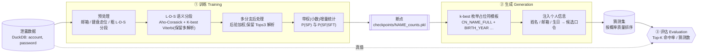

<div align="center">

# 🔐 SE-PCFG

**语义增强 · 个性化口令猜测研究框架**
*A semantically-enhanced, personalized PCFG for password-guessing research*

[](https://www.python.org/)
[](https://duckdb.org/)
[](https://pypi.org/project/pyahocorasick/)
[](#-快速开始--quickstart)
[](#️-使用须知--responsible-use)

</div>

---

## ⚠️ 使用须知 · Responsible use

本项目是**口令安全研究**代码,用于研究人类口令的构造规律、评估口令强度、以及量化在给定个人信息下口令被针对性猜中的风险。

- ✅ 允许:学术研究、口令强度评估、企业自查、面向自有账户/已获授权目标的安全测试。
- 🚫 禁止:未经授权对他人账户进行猜测、撞库或任何形式的攻击。

使用者须对自身行为负全部责任,并遵守所在司法辖区的法律法规。仓库不附带任何泄露数据集或个人信息;所有敏感产物(数据集、断点、生成的明文口令、`teacher.csv`)均已在 [`.gitignore`](.gitignore) 中排除,请勿提交。

---

## 核心思想 · The core idea

一个口令片段的语义往往**天然歧义**。拼音串 `wangfei` 既可能是整名「王菲」,也可能是 `wang`+`fei` 两个音节;`summer` 既是英文单词,也可以是人名。

传统 PCFG 在训练时必须**当场二选一**:挑概率最高的那条切分,给它记一次数,其余读法一概丢弃。SE-PCFG 换了个思路——**不急着消歧**:同一条口令保留多条相互竞争的语义解析,让**每一种读法都按自己的后验概率,贡献一小份计数**。

> **经典 PCFG:** 一条口令 → 一种结构 → 整数 `+1`
> **SE-PCFG:** 一条口令 → 一个解析分布 → 若干结构各得一份**小数**计数,权重和为 1

### 一个例子

口令 `wangfei2020`,分段器给出两条竞争解析(经后验归一):

| 解析 | 结构(SP) | 权重 |
|------|-----------|:---:|
| `(wangfei, cn_name_full)(2020, year)` | `cn_name_full · year` | **0.7** |
| `(wang, py)(fei, py)(2020, year)` | `py · py · year` | **0.3** |

于是这条口令的「一份证据」被这样记账:

```text
sp_counts["cn_name_full · year"] += 0.7      # 而非经典 PCFG 的 += 1
sp_counts["py · py · year"]      += 0.3
sft_counts["cn_name_full"]["wangfei"] += 0.7
sft_counts["py"]["wang"] += 0.3 ; sft_counts["py"]["fei"] += 0.3
sft_counts["year"]["2020"] += 1.0            # 两条解析都用到,合计为 1
```

总量仍是 1,但这份证据被**分散**到了它真正可能属于的多个语义结构上。最终 `P(SP)` 与 `P(SF|SFT)` 都在这套软计数上归一。据我们的调研,**目前尚无已公开的口令猜测模型这样做**——详见 [与已有工作的关系](#与已有工作的关系--relation-to-prior-work)。

---

## 设计亮点 · Highlights

- **🎯 多解析软计数(核心)** — 如上所述,一条口令按后验把计数拆给多条竞争解析,而非只喂给 argmax。计数表为 `defaultdict(float)`,每次自增都是 `+= w`。
  <br/>相关:[`training/training_manager.py`](training/training_manager.py) · [`training/incremental_trainer.py`](training/incremental_trainer.py)

- **🔀 保歧义的 K-best 词格** — 对字母段,先用所有检测器(英文姓名/词、拼音、中文姓名、未知段)在同一跨度并排铺边构成词格,跑 K-best Viterbi(`TOPK_L=5`)保留**多条**切分;同一跨度可并存 `cn_name` / `py` / `en` 等竞争标签,再由笛卡尔展开成整条解析交给软计数。
  <br/>相关:[`training/segmenter/segment_l_d_s.py`](training/segmenter/segment_l_d_s.py) · [`training/segmenter/postprocessor.py`](training/segmenter/postprocessor.py)

- **🀄 面向中文的丰富语义标签** — 把中文姓名的多种**角色化拼音形态**做成一等文法终结符:全拼 `cn_name_full`、仅名 `cn_name_given`、姓+名首字母 `cn_name_last_abbr`、全首字母 `cn_name_abbr`、**倒序**名+姓 `cn_name_first_last`、仅姓 `cn_name_last_full`,外加两种分隔符注入变体 `*_special`——姓名之间的 `@/_/.` 由一个前置自动机吸收进单个姓名终结符,不会被粗分拆散。此外还识别键盘走位(`kb{len}`、`kb3`)、日期(`year`/`yymmdd`/`yyyymmdd`)、中国手机号(`cn_mobile`,校验运营商前缀)、重复串 `sr{n}`、递增字母 `alpha{n}`、leet 还原等。
  <br/>相关:[`training/automachine.py`](training/automachine.py) · [`training/segmenter/`](training/segmenter/)

- **👤 账号关联的个性化** — 预处理会标注口令复用了账号哪一部分:`acc_pwd_same`(口令=/含账号)、`acc_email_name`(邮箱用户名)、`acc_email_domain`(邮箱域名)等关联标签。生成阶段再把学到的分布转成占位符模板(`<CN_NAME_FULL>` / `<BIRTH_YEAR>` / `<PHONENUM>`…),从 `teacher.csv` 用**某个具体目标**的真实姓名/邮箱/生日/电话实例化,产出针对该人的候选口令。
  <br/>相关:[`training/segmenter/preprocessor.py`](training/segmenter/preprocessor.py) · [`generation/password_gen_tools/`](generation/password_gen_tools/)

- **⚙️ 工程实现** — DuckDB 大表分批读取、多进程并行解析、断点自动保存与续训、可选顺序/随机窗口采样;训练日志与分析输出默认对表面形式做脱敏(字符形状 + 短哈希)。

---

## 与已有工作的关系 · Relation to prior work

SE-PCFG 站在一系列口令 PCFG 工作的肩膀上,主要区别集中在**训练时如何处理切分歧义**,以及**对中文口令的语义建模**:

| 模型 | 每条口令的切分 | 计数 | 中文姓名建模 | 个性化 |
|------|:---:|:---:|---|:---:|
| Weir 2009(原始 PCFG) | 单一 `L/D/S` | 整数 | — | — |
| Veras 2014(语义 PCFG) | 单一最优 | 整数 | 通用英文词/名/日期 | — |
| TarGuess-I / Personal-PCFG | 单一 | 整数 | 姓名角色标签(定向 PII 注入) | ✅ 定向 PII |
| SE#PCFG(2025) | 单一(优先级定) | 整数 | 缩写 + 音节级拼音 | — |
| **SE-PCFG(本项目)** | **保留多条 K-best** | **小数软计数** | **角色化全拼姓名 + 分隔符吸收** | 关联 PII 标签 + 逐目标注入 |

几点如实说明,便于你准确定位本项目的贡献:

- **软计数/多切分本身是成熟的 NLP 技术**(inside-outside EM、Kudo 2018 subword regularization 都对多切分做概率加权),SE-PCFG 的价值在于**把它带进口令猜测**这个此前一律「单切分 + 整数计数」的领域,而不是发明该机制。
- 当前实现是**一次性的**启发式加权(权重来自手设先验 + 路径罚项 + soft-max 温度),**不是迭代式 EM**,也未用模型自身概率重估权重——因此更准确的说法是「后验加权的多解析软计数」。
- **角色化姓名形态**在定向猜测里已有先例(TarGuess-I 的 N1–N7);本项目的侧重点是把它作为一等终结符放进**撞库(trawling)语法**,并补上分隔符吸收(暂不建模复姓)。
- 想量化收益时,可用仓库中**并存的经典整数单解析实现** [`pcfg_trainer.py`](pcfg_trainer.py)(`defaultdict(int)` / `+= 1`)作对照基线,在相同猜测预算下比较命中率。

### 核心术语 · Glossary

| 记号 | 含义 |
|------|------|
| **L / D / S** | 粗分段:Letter(字母段)/ Digit(数字段)/ Symbol(符号段) |
| **SF** *(Surface Form)* | 片段的实际文本,如 `wangfei`、`2020`、`@` |
| **SFT** *(Surface-Form Type)* | 片段的**语义标签**,如 `cn_name_full`、`en_word`、`kb4`、`year`、`acc_pwd_same` |
| **SP** *(Structure Pattern)* | 一条口令的 SFT 序列 = 语法的「模板」,如 `cn_name_full · year` |
| **w** *(weight)* | 某条解析的后验权重;同一口令各解析权重和为 1,以小数累加进计数表 |

---

## 工作流水线 · Pipeline



| 阶段 | 入口 | 作用 |
|------|------|------|
| ① 训练 | `python -m training.main` | 从泄露库学习语义 PCFG,输出断点 `checkpoints/<NAME>_counts.pkl` |
| ② 生成 | `generation/password_gen_tools/pipeline.py` | 由断点枚举模板 → 注入目标个人信息 → 产出候选口令列表 |
| ③ 评估 | `new_eval.py` | 用生成的口令集对真值库做 Top-K 命中率评估 |

---

## 快速开始 · Quickstart

### 1) 环境与依赖

需要 Python 3.9+。建议在项目内建虚拟环境(系统 Python 可能无写权限):

```bash
python3 -m venv .venv
.venv/bin/python -m pip install -U pip
.venv/bin/python -m pip install duckdb pandas pyahocorasick pypinyin
```

> `pypinyin` 仅用于生成阶段填充中文姓名占位符;不装也能跑,但相关中文占位符会被跳过。

### 2) 准备数据

数据集**不随仓库分发**,需自备一个 DuckDB 文件,包含一张表:

| 期望的 Schema | 值 | 对应配置 |
|------|------|------|
| 表名 | `breaches` | `TABLE_NAME` |
| 列 | `account`, `password` | `ACCOUNT_COL` / `PASSWORD_COL` |

用环境变量指向该文件(也可放到 `data/combcn2021.duckdb` 由默认路径拾取):

```bash
export SE_PCFG_DUCKDB_PATH="/path/to/your_dataset.duckdb"
```

### 3) 训练

```bash
export SE_PCFG_TRAIN_NAME="my_training_20250515"   # 断点命名
.venv/bin/python -m training.main
```

训练按 batch 并行处理(默认 4 进程),**自动保存断点、支持断点续训**。结束时打印 Top SP 模板与部分 SFT→SF 分布(默认对表面形式做脱敏)。

### 4) 生成候选口令

```bash
export SE_PCFG_TRAIN_NAME="my_training_20250515"   # 选用对应断点

# 一键跑完两步(生成模板 + 注入个人信息)
.venv/bin/python generation/password_gen_tools/pipeline.py
```

按需选择输出形态:

```bash
# 分析用 · 脱敏:输出「模式串」,按概率质量排序,不落地明文
.venv/bin/python generation/password_gen_tools/pipeline.py --pattern-mass --top-k 100 --max-templates 10000

# 分析用 · 明文:会落地明文口令(请勿提交仓库)
.venv/bin/python generation/password_gen_tools/pipeline.py --plain-mass  --top-k 100 --max-templates 10000

# 旧版「逐模板逐变体」输出(可能非常大且含明文)
.venv/bin/python generation/password_gen_tools/pipeline.py --raw
```

也可单独运行两步:

```bash
.venv/bin/python generation/password_gen_tools/generate_placeholders.py   # → placeholders1.txt
.venv/bin/python generation/password_gen_tools/fill_placeholders.py       # 读 teacher.csv → fulllist/*.txt
```

### 5) 评估

将 `data/generated_passwords_pruned_*M.txt` 准备好后:

```bash
.venv/bin/python new_eval.py     # 输出各规模模型在 Top-1000…10000 的命中率 → CSV
```

---

## 配置项 · Configuration

全部通过环境变量控制,定义见 [`config.py`](config.py)。常用项:

| 环境变量 | 默认值 | 说明 |
|----------|--------|------|
| `SE_PCFG_DUCKDB_PATH` | *(必填)* | DuckDB 数据集路径(亦可用 `DUCKDB_PATH`) |
| `SE_PCFG_TRAIN_NAME` | `my_training_20250515` | 训练/断点命名 |
| `SE_PCFG_CHECKPOINT_DIR` | `./checkpoints` | 断点与状态文件目录 |
| `SE_PCFG_BATCH_SIZE` | `100000` | 每批处理条数 |
| `SE_PCFG_TRAIN_DATA_SIZE` | `5000000` | 本次训练总处理条数 |
| `SE_PCFG_WORKERS` | `4` | 训练并行进程数 |
| `SE_PCFG_TOPK_L` | `5` | 字母段 K-best 保留的解析条数 |
| `SE_PCFG_EXPAND_TOP_PATHS` | `20` | 多分支笛卡尔展开保留的整解析上限 |
| `SE_PCFG_RESUME_TRAINING` | `true` | `true` 续训 / `false` 从头训练 |
| `SE_PCFG_SAMPLE_MODE` | `sequential` | 采样方式:`sequential` / `random_window` |
| `SE_PCFG_MP_START_METHOD` | `spawn` | 多进程启动方式:`spawn` / `fork` / `forkserver` |
| `SE_PCFG_EXPORT_REPORT` | `false` | 训练后导出脱敏汇总报告到 `exports/` |
| `SE_PCFG_SHOW_RAW_SFT` | `false` | 打印 SFT→SF 时显示明文(默认脱敏为「形状+哈希」) |

> 软计数的选择参数(`TEMP_ALPHA=1.8`、后验阈值 `0.1`、每口令至多 `3` 条解析)见 [`training/training_manager.py`](training/training_manager.py) 顶部常量。

---

## 目录结构 · Project layout

```
sepcfg/
├── config.py                     # 全局配置(路径 / 环境变量 / 采样与并行参数)
├── training/                     # ① 训练
│   ├── main.py                   #   训练入口
│   ├── training_manager.py       #   批处理调度 + 多进程池 + 后验加权选择
│   ├── incremental_trainer.py    #   带权(小数)增量统计 → P(SP), P(SF|SFT)
│   ├── data_retriever.py         #   DuckDB 取数
│   ├── automachine.py            #   Aho-Corasick 自动机封装(含 *_special 姓名)
│   ├── build_english_*_automaton.py  # 英文姓名 / 英文词典自动机构建
│   └── segmenter/                #   语义分段器
│       ├── preprocessor.py       #     邮箱 / 键盘走位 / 中文姓名 预处理
│       ├── segment_l_d_s.py      #     L-D-S 语义细分(K-best Viterbi)
│       ├── postprocessor.py      #     多分支解析路径笛卡尔展开与合并
│       ├── cn_name_detection.py  #     中文姓名(全拼/缩写等,同区间多标签)检测
│       └── keyboard_walk.py      #     US-QWERTY 键盘走位检测
├── generation/password_gen_tools/    # ② 生成
│   ├── pipeline.py               #   一键:模板 → 注入
│   ├── generate_placeholders.py  #   由断点 k-best 枚举占位符模板
│   ├── fill_placeholders.py      #   注入个人信息 → 候选口令
│   └── audit_placeholders.py     #   占位符校验
├── new_eval.py                   # ③ Top-K 命中率评估
├── pcfg_trainer.py               # 经典整数单解析对照实现(可作 baseline)
├── parallel_pcfg.py              # K-best Viterbi 并行解析独立 demo
├── stress_test/                  # 登录接口压测(授权测试用)
└── drafts/                       # 早期实验脚本(存档)
```

---

## 隐私与安全 · Privacy & safety

- **默认脱敏**:训练日志、汇总报告与 `--pattern-mass` 输出均以「字符形状 + SHA-256 短哈希」代替明文,便于分析而不落地真实口令。
- **敏感文件隔离**:数据集、断点、`teacher.csv`、任何 `generated_passwords*.txt` 均由 `.gitignore` 排除,不会被误提交。
- **跨平台路径**:历史 Windows 绝对路径已统一为「项目根目录相对路径 + 环境变量」,见 `config.py`。

---

<div align="center">
<sub>仅供口令安全研究与授权测试使用 · For password-security research and authorized testing only</sub>
</div>
