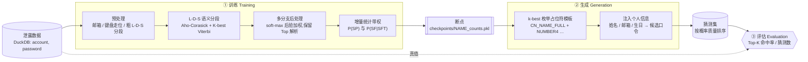

<div align="center">

# 🔐 SE-PCFG

**语义增强 · 个性化口令猜测研究框架**
*A semantically-enhanced, personalized PCFG for password-guessing research*

[](https://www.python.org/)
[](https://duckdb.org/)
[](https://pypi.org/project/pyahocorasick/)
[](#-快速开始--quickstart)
[](#️-使用须知--responsible-use)

</div>

---

## ⚠️ 使用须知 · Responsible use

本项目是**口令安全研究**代码,用于研究人类口令的构造规律、评估口令强度、以及量化在给定个人信息下口令被针对性猜中的风险。

- ✅ 允许:学术研究、口令强度评估、企业自查、面向自有账户/已获授权目标的安全测试。
- 🚫 禁止:未经授权对他人账户进行猜测、撞库或任何形式的攻击。

使用者须对自身行为负全部责任,并遵守所在司法辖区的法律法规。仓库不附带任何泄露数据集或个人信息;所有敏感产物(数据集、断点、生成的明文口令、`teacher.csv`)均已在 [`.gitignore`](.gitignore) 中排除,请勿提交。

---

## 这是什么 · What is it

传统 PCFG(Weir et al.)只把口令按**字符类别**切成 `L`(字母)/`D`(数字)/`S`(符号),丢掉了语义。本项目在此之上做了两件事:

1. **语义化(Semantic)** —— 不再只看字符类别,而是把片段识别成有意义的**语义标签**:中文姓名拼音(全拼/首字母/姓+名缩写…)、英文姓名、英文词、键盘走位(`1qaz`、`qwerty`)、日期、邮箱前缀/域名等。
2. **个性化(Personalized)** —— 把**账号与口令联合建模**(中间用 `acc_pwd_sep` 分隔),从而学到「口令复用了账号/邮箱/姓名的哪一部分」这种关联。生成阶段再把某个具体目标的个人信息注入模板,产出**针对该人**的候选口令,而非通用字典。

一句话:**从「这个口令长什么样」升级到「这个人会怎么设口令」。**

### 核心术语 · Glossary

| 记号 | 含义 |
|------|------|
| **L / D / S** | 粗分段:Letter(字母段)/ Digit(数字段)/ Symbol(符号段) |
| **SF** *(Surface Form)* | 片段的实际文本,如 `zhangsan`、`1314`、`@` |
| **SFT** *(Surface-Form Type)* | 片段的**语义标签**,如 `cn_name_full`、`en_word`、`keyboard_walk`、`number4`、`acc_pwd_same` |
| **SP** *(Structure Pattern)* | 一条口令的 SFT 序列 = 语法的「模板」,如 `cn_name_full · number4` |

PCFG 训练即统计两组概率:`P(SP)`(模板出现概率)与 `P(SF | SFT)`(每种语义标签下各表面形式的概率)。

---

## 工作流水线 · Pipeline



三个阶段各自对应仓库中的入口:

| 阶段 | 入口 | 作用 |
|------|------|------|
| ① 训练 | `python -m training.main` | 从泄露库学习语义 PCFG,输出断点 `checkpoints/<NAME>_counts.pkl` |
| ② 生成 | `generation/password_gen_tools/pipeline.py` | 由断点枚举模板 → 注入目标个人信息 → 产出候选口令列表 |
| ③ 评估 | `new_eval.py` | 用生成的口令集对真值库做 Top-K 命中率评估 |

---

## 快速开始 · Quickstart

### 1) 环境与依赖

需要 Python 3.9+。建议在项目内建虚拟环境(系统 Python 可能无写权限):

```bash
python3 -m venv .venv
.venv/bin/python -m pip install -U pip
.venv/bin/python -m pip install duckdb pandas pyahocorasick pypinyin
```

> `pypinyin` 仅用于生成阶段填充中文姓名占位符;不装也能跑,但相关中文占位符会被跳过。

### 2) 准备数据

数据集**不随仓库分发**,需自备一个 DuckDB 文件,包含一张表:

| 期望的 Schema | 值 | 对应配置 |
|------|------|------|
| 表名 | `breaches` | `TABLE_NAME` |
| 列 | `account`, `password` | `ACCOUNT_COL` / `PASSWORD_COL` |

用环境变量指向该文件(也可放到 `data/combcn2021.duckdb` 由默认路径拾取):

```bash
export SE_PCFG_DUCKDB_PATH="/path/to/your_dataset.duckdb"
```

### 3) 训练

```bash
export SE_PCFG_TRAIN_NAME="my_training_20250515"   # 断点命名
.venv/bin/python -m training.main
```

训练按 batch 并行处理(默认 4 进程),**自动保存断点、支持断点续训**。结束时打印 Top SP 模板与部分 SFT→SF 分布(默认对表面形式做脱敏)。

### 4) 生成候选口令

```bash
export SE_PCFG_TRAIN_NAME="my_training_20250515"   # 选用对应断点

# 一键跑完两步(生成模板 + 注入个人信息)
.venv/bin/python generation/password_gen_tools/pipeline.py
```

按需选择输出形态:

```bash
# 分析用 · 脱敏:输出「模式串」,按概率质量排序,不落地明文
.venv/bin/python generation/password_gen_tools/pipeline.py --pattern-mass --top-k 100 --max-templates 10000

# 分析用 · 明文:会落地明文口令(请勿提交仓库)
.venv/bin/python generation/password_gen_tools/pipeline.py --plain-mass  --top-k 100 --max-templates 10000

# 旧版「逐模板逐变体」输出(可能非常大且含明文)
.venv/bin/python generation/password_gen_tools/pipeline.py --raw
```

也可单独运行两步:

```bash
.venv/bin/python generation/password_gen_tools/generate_placeholders.py   # → placeholders1.txt
.venv/bin/python generation/password_gen_tools/fill_placeholders.py       # 读 teacher.csv → fulllist/*.txt
```

### 5) 评估

将 `data/generated_passwords_pruned_*M.txt` 准备好后:

```bash
.venv/bin/python new_eval.py     # 输出各规模模型在 Top-1000…10000 的命中率 → CSV
```

---

## 配置项 · Configuration

全部通过环境变量控制,定义见 [`config.py`](config.py)。常用项:

| 环境变量 | 默认值 | 说明 |
|----------|--------|------|
| `SE_PCFG_DUCKDB_PATH` | *(必填)* | DuckDB 数据集路径(亦可用 `DUCKDB_PATH`) |
| `SE_PCFG_TRAIN_NAME` | `my_training_20250515` | 训练/断点命名 |
| `SE_PCFG_CHECKPOINT_DIR` | `./checkpoints` | 断点与状态文件目录 |
| `SE_PCFG_BATCH_SIZE` | `100000` | 每批处理条数 |
| `SE_PCFG_TRAIN_DATA_SIZE` | `5000000` | 本次训练总处理条数 |
| `SE_PCFG_WORKERS` | `4` | 训练并行进程数 |
| `SE_PCFG_RESUME_TRAINING` | `true` | `true` 续训 / `false` 从头训练 |
| `SE_PCFG_SAMPLE_MODE` | `sequential` | 采样方式:`sequential` / `random_window` |
| `SE_PCFG_MP_START_METHOD` | `spawn` | 多进程启动方式:`spawn` / `fork` / `forkserver` |
| `SE_PCFG_EXPORT_REPORT` | `false` | 训练后导出脱敏汇总报告到 `exports/` |
| `SE_PCFG_SHOW_RAW_SFT` | `false` | 打印 SFT→SF 时显示明文(默认脱敏为「形状+哈希」) |

---

## 目录结构 · Project layout

```
sepcfg/
├── config.py                     # 全局配置(路径 / 环境变量 / 采样与并行参数)
├── training/                     # ① 训练
│   ├── main.py                   #   训练入口
│   ├── training_manager.py       #   批处理调度 + 多进程池 + 断点续训
│   ├── incremental_trainer.py    #   带权增量统计 → P(SP), P(SF|SFT)
│   ├── data_retriever.py         #   DuckDB 取数
│   ├── automachine.py            #   Aho-Corasick 自动机封装
│   ├── build_english_*_automaton.py  # 英文姓名 / 英文词典自动机构建
│   └── segmenter/                #   语义分段器
│       ├── preprocessor.py       #     邮箱 / 键盘走位 / 中文姓名 预处理
│       ├── segment_l_d_s.py      #     L-D-S 语义细分(K-best Viterbi)
│       ├── postprocessor.py      #     多分支解析路径合并
│       ├── cn_name_detection.py  #     中文姓名(全拼/缩写等)检测
│       └── keyboard_walk.py      #     US-QWERTY 键盘走位检测
├── generation/password_gen_tools/    # ② 生成
│   ├── pipeline.py               #   一键:模板 → 注入
│   ├── generate_placeholders.py  #   由断点 k-best 枚举占位符模板
│   ├── fill_placeholders.py      #   注入个人信息 → 候选口令
│   └── audit_placeholders.py     #   占位符校验
├── new_eval.py                   # ③ Top-K 命中率评估
├── pcfg_trainer.py               # 语义 PCFG 概率统计(参考实现)
├── parallel_pcfg.py              # K-best Viterbi 并行解析独立 demo
├── stress_test/                  # 登录接口压测(授权测试用)
└── drafts/                       # 早期实验脚本(存档)
```

---

## 隐私与安全 · Privacy & safety

- **默认脱敏**:训练日志、汇总报告与 `--pattern-mass` 输出均以「字符形状 + SHA-256 短哈希」代替明文,便于分析而不落地真实口令。
- **敏感文件隔离**:数据集、断点、`teacher.csv`、任何 `generated_passwords*.txt` 均由 `.gitignore` 排除,不会被误提交。
- **跨平台路径**:历史 Windows 绝对路径已统一为「项目根目录相对路径 + 环境变量」,见 `config.py`。

---

<div align="center">
<sub>仅供口令安全研究与授权测试使用 · For password-security research and authorized testing only</sub>
</div>
